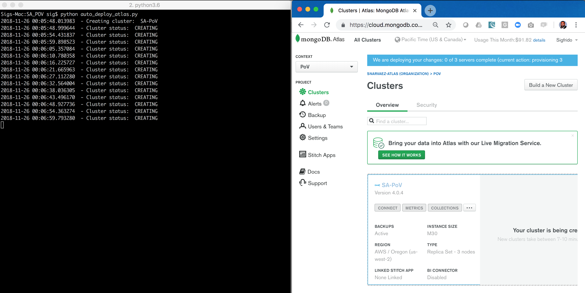
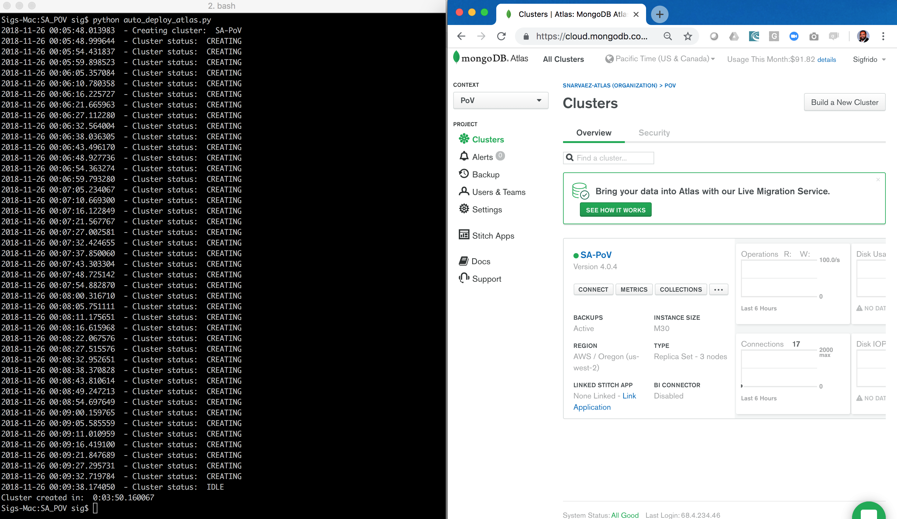

# CLUSTER-CREATE

This script demonstrates the ability to automate the deployment & configuration of a production ready MongoDB Atlas cluster deployment, which is ready live within X minutes of invoking a single command.

## Description

Deploying a production-ready cluster requires __expertise__ and  __strict adherence__ to an [operations checklist](https://docs.mongodb.com/manual/administration/production-checklist-operations/) alongside __security hardening and certification__, for each cluster that an organization may require for their full SDLC (e.g. development, testing, production, etc.), and for __every time__ that maintenance, upscale, downscale or a change to the configuration of any cluster is required.

__Cluster creation should take between 5 to 10 minutes__ depending heavily on the time it takes Atlas to create the cluster.

## Setup
__1. Configure Laptop & Cloud Accounts__
* Ensure you have an __Atlas__ account ready to use
* Ensure your laptop can run __Python 3__. Please follow the installation steps for your operating system and version as described in the [Python setup and usage](https://docs.python.org/3/using/index.html) guide

__2. Configure Atlas Environment__
* As this script requires use of the REST API, an API key and whitelisting the IP from where this script will execute is required
* Log-on to your [Atlas account](http://cloud.mongodb.com)
* In the [Public API Access](https://cloud.mongodb.com/v2#/account/publicApi) configuration of your Atlas Account, ensure you have [generated your own API key and whitelist the IP](https://docs.atlas.mongodb.com/configure-api-access/) from where the script will be executed.
* As MongoDB Atlas clusters are created under an Organization and Project. In the [Organizations](https://cloud.mongodb.com/v2#/account/organizations) tab, ensure you have [created](https://docs.atlas.mongodb.com/tutorial/manage-organizations/#create-an-organization) the organization to be used in this script.
* Select that Organization, and ensure you have [created](https://docs.atlas.mongodb.com/tutorial/manage-projects/#create-a-project) the Project to be used in this script.
* Select that Project and capture its ID from the URL in the browser (e.g. https://cloud.mongodb.com/v2/PROJECTID#clusters)


## Execution

__1. Enter your Atlas credentials in the Python script__
* Overwrite the following python variables in the [cluster-create.py](py,cluster-create.py) python script with the values of your Atlas User Name, API Key and Project ID.

```
_userName    = "ATLAS-USER-NAME"_
_apiKey      = "ATLAS-API-KEY"_
_projectId   = "ATLAS-PROJECTID"_
```
__1a. (OPTIONAL) Set additional  cluster configuration parameters__

* The Atlas API receives a payload that describes the cluster configuration (e.g. instance size, cloud provider, etc.)
* This script creates a standard M30 cluster on AWS on the US_WEST_2 region with backup enabled and encrypted EBS volumes, as described in this payload:
```
data = {
  "name" : clusterName,
  "clusterType" : "REPLICASET",
  "mongoDBMajorVersion": "4.0",
  "numShards" : 1,
  "providerSettings" : {
    "providerName" : "AWS",
    "regionName" : "US_WEST_2",
    "instanceSizeName" : "M30",
    "encryptEBSVolume" : True
  },
  "replicationFactor" : 3,
  "backupEnabled" : True,
  "autoScaling" : { "diskGBEnabled" : True }
}
```
* The payload can be changed to fit the needs of your audience or demo. The full list of parameters can be found in the [request body parameters](https://docs.atlas.mongodb.com/reference/api/clusters-create-one/#request-body-parameters) documentation.

__2. Execute the Python script__
* Run the Python script as follows from a terminal window on your laptop:
```
$ python cluster-create.py
```
* The script will invoke  the Atlas API and start the cluster creation
* The cluster will stay in __CREATING__ status through out the creation process
* During which, the Python script will poll every 5 seconds until the cluster status changes to __IDLE__.
* For a list of possible status values, see the reference in the [MongoDB Atlas API documentation](https://docs.atlas.mongodb.com/reference/api/clusters-get-one/#http-response-elements)

__3. Demonstrate the cluster deployment in the MongoDB Atlas UI__
* While the script is executing, place the terminal and Atlas windows side-by-side




## Confirmation

When finished, the cluster status changes from __CREATING__ to __IDLE__ and the script will report the total creation time.

```
$ python cluster-create.py
2018-11-26 00:05:48.013983  - Creating cluster:  SA-PoV
2018-11-26 00:05:48.999644  - Cluster status:  CREATING
...
2018-11-26 00:09:32.719784  - Cluster status:  CREATING
2018-11-26 00:09:38.174050  - Cluster status:  IDLE
Cluster created in:  0:03:50.160067
```

The Atlas UI will change to notify the user that the cluster is now created ready for access.


